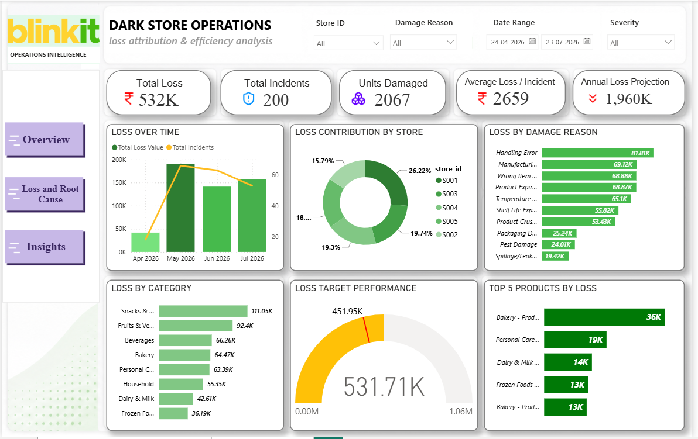
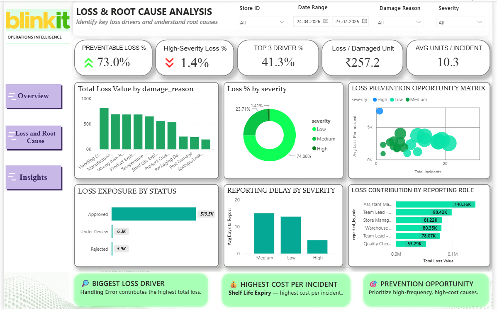
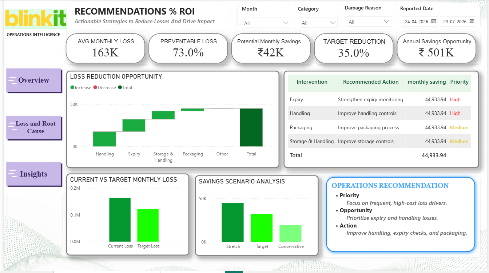

# Blinkit Dark Store Operations
## Loss Attribution & Efficiency Analysis

<p align="center">
  
</p>

<p align="center">
  <strong>An end-to-end operational analytics case study focused on identifying, prioritizing, and reducing dark-store inventory losses.</strong>
</p>

<p align="center">
  Python • Pandas • NumPy • Matplotlib • Seaborn • Power BI • DAX
</p>

---

# 📌 Executive Overview

Dark-store operations involve high-velocity inventory movement across receiving, storage, picking, packing, and dispatch. Operational incidents such as handling errors, picking mistakes, expiry, packaging issues, product defects, and storage-related problems can create recurring financial losses.

This project analyzes operational incident data to understand:

- How much financial loss is occurring?
- Which damage reasons contribute the most loss?
- What proportion of losses is potentially preventable?
- Which stores have the highest exposure?
- Which operational areas should be prioritized?
- What financial opportunity could result from reducing preventable losses?

The project combines **Python-based exploratory analysis** with a **Power BI Operations Intelligence dashboard** to move from raw operational data to actionable business recommendations.

<p align="center">
  
</p>
---

# 🗓️ Analysis Period

**24 April 2026 – 23 July 2026**

The Power BI dashboard uses this reporting window for the executive analysis.

---

# 💰 Business Impact

| KPI | Result |
|:---|---:|
| 💸 **Total Loss** | **₹532K** |
| 🚨 **Total Incidents** | **200** |
| 📦 **Units Damaged** | **2,067** |
| 💵 **Average Loss / Incident** | **₹2,659** |
| 📈 **Annual Loss Projection** | **₹1.96M** |
| 🛡️ **Preventable Loss** | **73.0%** |
| 🎯 **Top 3 Driver Contribution** | **41.3%** |
| 🏪 **Highest Loss Store** | **S001 — 26.22%** |
| 💰 **Potential Monthly Savings** | **₹42K** |
| 📊 **Target Reduction** | **35%** |
| 💎 **Annual Savings Opportunity** | **₹501K*** |

\* The ₹501K figure represents a **scenario-based annual savings opportunity under the defined 35% target-reduction scenario**. It is not a guaranteed realized saving.

---

# 🎯 Business Problem

The purpose of this project was to move beyond simply reporting operational losses and identify **where prevention efforts can create measurable business value**.

The analysis focuses on operational loss categories including:

- Handling Error
- Manufacturing Defect
- Wrong Item Picked
- Product Expiry
- Temperature-related issues
- Shelf Life Expiry
- Product Crush/Damage
- Packaging Damage
- Pest Damage
- Spillage/Leakage
- Storage & Handling issues

The objective is to identify the **highest-impact and most actionable drivers** and translate those findings into operational interventions.


<p align="center">
  
</p>
---


<p align="center">
  
</p>
# 🔬 Analytical Framework

```text
Raw Operational Data
        ↓
Data Quality Assessment
        ↓
Data Preparation
        ↓
Exploratory Data Analysis
        ↓
Loss Attribution
        ↓
Root Cause Analysis
        ↓
Store & Role Analysis
        ↓
Prevention Opportunity Analysis
        ↓
Business Recommendations
        ↓
Savings Scenario
        ↓
Power BI Dashboard
        ↓
Executive Decision Support
