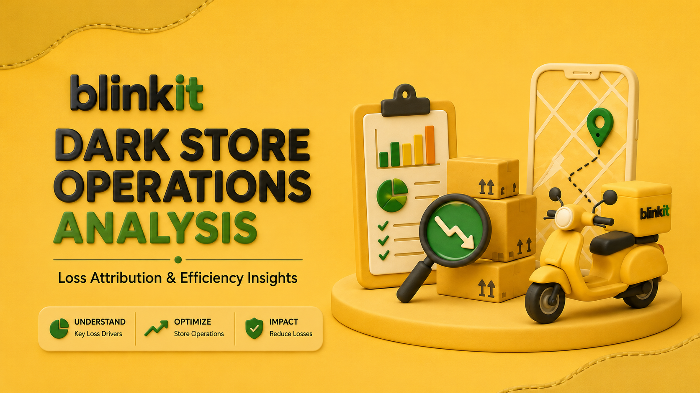

# Blinkit Dark Store Operations
## Loss Attribution & Efficiency Analysis

<p align="center">
  
</p>

<p align="center">
  <b>An end-to-end operational analytics case study focused on identifying, prioritizing and reducing dark-store inventory losses.</b>
</p>

<p align="center">
  Python • Pandas • NumPy • Matplotlib • Seaborn • Power BI • DAX
</p>

---

# 📌 Executive Overview

Dark-store operations operate in a high-velocity environment where inventory moves rapidly through receiving, storage, picking, packing and dispatch.

Operational failures such as handling errors, picking mistakes, expiry, packaging issues and product defects can create recurring financial losses.

This project analyzes operational incident data to answer five key business questions:

1. **How much loss is occurring?**
2. **What are the primary drivers of loss?**
3. **Which losses are potentially preventable?**
4. **Where should operational teams prioritize intervention?**
5. **What financial opportunity could result from reducing preventable losses?**

The analysis combines **Python-based exploratory analysis** with an interactive **Power BI operations intelligence dashboard** to transform raw incident data into actionable business recommendations.

---

# 💰 Business Impact

| KPI | Result |
|:---:|:---:|
| 💸 **Total Loss** | **₹532K** |
| 🚨 **Total Incidents** | **200** |
| 📦 **Units Damaged** | **2,067** |
| 🛡️ **Preventable Loss** | **73.0%** |
| 🎯 **Top 3 Driver Contribution** | **41.3%** |
| 🏪 **Highest Loss Store** | **S001 — 26.22%** |
| 💰 **Potential Monthly Savings** | **₹42K** |
| 📈 **Annual Savings Opportunity** | **₹501K*** |

\* The ₹501K figure represents a **scenario-based annual savings opportunity under the defined 35% target-reduction scenario**. It is not a guaranteed realized saving.

---

# 🗓️ Analysis Period

**24 April 2026 – 23 July 2026**

The Power BI dashboard uses this reporting window for the executive analysis.

---

# 🎯 Business Problem

The objective of this project was to move beyond simply reporting operational losses and identify **where prevention efforts can create measurable business value**.

The analysis focuses on losses associated with:

- Handling errors
- Manufacturing defects
- Wrong item picking
- Product expiry
- Temperature-related issues
- Shelf-life expiry
- Packaging damage
- Product crush/damage
- Pest damage
- Spillage/leakage
- Storage and handling issues

The goal is to identify the **highest-impact and most actionable loss drivers** rather than treating every incident equally.

---

# 🔬 Analytical Framework

The project follows a structured business analytics framework:

```text
             RAW OPERATIONAL DATA
                      │
                      ▼
              DATA QUALITY CHECK
                      │
                      ▼
             DATA PREPARATION
                      │
                      ▼
             EXPLORATORY ANALYSIS
                      │
                      ▼
             LOSS ATTRIBUTION
                      │
             ┌────────┴────────┐
             ▼                 ▼
       ROOT CAUSE          STORE / ROLE
        ANALYSIS            ANALYSIS
             │                 │
             └────────┬────────┘
                      ▼
              PREVENTION ANALYSIS
                      │
                      ▼
             BUSINESS PRIORITIES
                      │
                      ▼
             SAVINGS SCENARIO
                      │
                      ▼
             POWER BI DASHBOARD
                      │
                      ▼
              ACTIONABLE INSIGHTS
